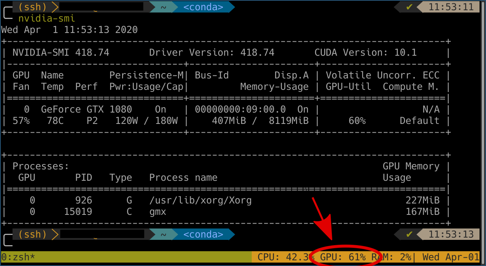

# tmux-plugin-simple-gpu
tmux plugin showing GPU usage



Requirements
------------
For NVIDIA monitoring cuda toolkit must be installed (the plugin internally calls `nvidia-smi`)

For AMD change the read/execute permission
```sh
sudo chmod a+rx /sys/class/drm/card0/device/gpu_busy_percent
```

Installation
------------
### Installation with [Tmux Plugin Manager](https://github.com/tmux-plugins/tpm) (recommended)

Add plugin to the list of TPM plugins in `.tmux.conf`:

```tmux
set -g @plugin 'arminveres/tmux-simple-gpu'
```

Hit `prefix + I` to fetch the plugin and source it.

If format strings are added to `status-right`, they should now be visible.

Usage
-----

In order to see GPU usage via this tmux plugin, add the following command to your `.tmux.conf` file:

```
#{gpu}
```

Kudos
----------
I used https://github.com/danijoo/tmux-plugin-simple-gpu as a base/fork for this
and he in turn used https://github.com/pwittchen/tmux-plugin-ram as a base.
