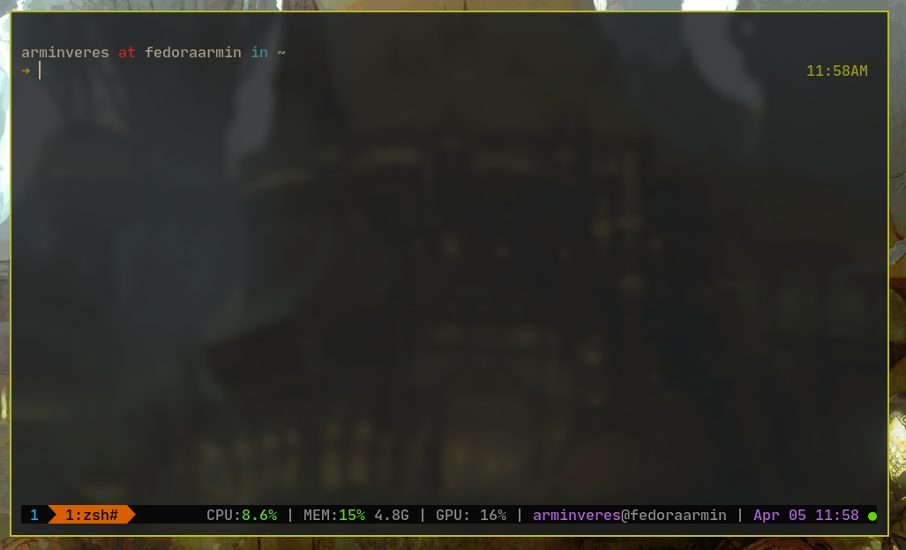

# tmux-plugin-gpu

tmux plugin showing GPU usage



## Requirements

ATM `glxinfo` is required for determining the vendor.

For NVIDIA monitoring cuda toolkit must be installed (the plugin internally calls `nvidia-smi`)

For AMD install radeontop

## Installation

### Installation with [Tmux Plugin Manager](https://github.com/tmux-plugins/tpm) (recommended)

Add plugin to the list of TPM plugins in `.tmux.conf`:

```tmux
set -g @plugin 'arminveres/tmux-simple-gpu'
```

Hit `prefix + I` to fetch the plugin and source it.

If format strings are added to `status-right`, they should now be visible.

## Usage

In order to see GPU usage via this tmux plugin, add the following command to your `.tmux.conf` file:

```
#{gpu}
```

## TODO

- [x] add AMD GPU support
- [x] move over to radeontop
- [ ] add Intel iGPU support
- [ ] add support for VRAM usage, clock etc.

## Acknowledgements

I used https://github.com/danijoo/tmux-plugin-simple-gpu as a base/fork for this
and he in turn used https://github.com/pwittchen/tmux-plugin-ram as a base.
